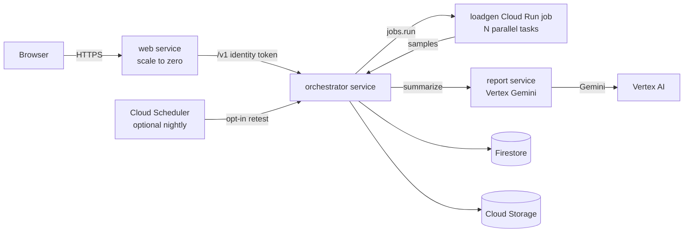

# Stampede

Will your app survive the Product Hunt front page? Find out in 60 seconds.

Stampede is a launch check for makers. Paste a URL you own, prove it, pick a Product Hunt-shaped traffic curve, and watch requests per second, latency, and errors ramp until the run finds a breaking point. You get a readiness report, a Cloud Run cost estimate, and a shareable badge.

It is built to deploy on Google Cloud Run for the Product Hunt × Google Cloud Run hackathon (launch window Wednesday 14 October 2026). The same product runs locally and in CI with no Google Cloud credentials.

## Architecture



| Piece | What it does | Local stand-in |
| --- | --- | --- |
| `web` | Dark UI. Proxies `/v1`. Public, scales to zero. | `cmd/web` on `:8080`, static files from `web/dist` |
| `orchestrator` | Ownership, quotas, runs, SSE, kill switch | `cmd/orchestrator` on `:8081`, SQLite |
| `loadgen` | GET-only ramp. Cloud Run **job** with parallel tasks | In-process workers (`LOADGEN_MODE=inprocess`) |
| `report` | Readiness prose via Vertex Gemini | Deterministic template, no API key |
| Firestore | Runs, samples, challenges, quotas | SQLite (`data/stampede.db`) or memory in tests |
| Cloud Storage | Report JSON and badge SVG | `data/artifacts` (badges are also served by the API) |
| Demo shop | A site we own, so the demo can prove ownership | `cmd/target` on `:8090` |

On Cloud Run the browser only talks to `web`. `web` attaches a Cloud Run identity token when it calls the orchestrator. If the caller sent an admin bearer token, `web` moves it to `X-Stampede-Admin` so the identity token does not replace it. Loadgen tasks and the report service use the same internal token plus their own identity tokens. The job is started with a cloud-platform access token, which is what the Cloud Run jobs API expects.

## Traffic assumptions

These curves are planning shapes, not an official Product Hunt traffic feed. The same text is on each preset in the UI.

- A **Top 5 of the Day** launch is planned as roughly **2,000–4,000** launch-day unique visitors. The curve climbs, holds a plateau at **75% of the safety cap**, then eases off.
- A **#1 Product of the Day** launch is planned as roughly **6,000–15,000** launch-day uniques, with about a quarter of them in the first two hours. The curve spikes faster and holds the **full cap**.
- A typical maker page is about **10 HTTP requests per visitor** (the document plus its assets).
- Stampede **compresses the launch morning into 45 seconds** (never more than 3 minutes) so you can see the shape without a flood.
- Absolute rates are **scaled to the safety cap** (default 40 requests/second and 50 workers). The shape is the point. The magnitude stays small on purpose.

Workers move from **10 to 50** across the run. Locally those are goroutines. On Cloud Run the same curve is split across 10 parallel job tasks.

The demo shop, Northwind Kits, is built to fold: above about 24 requests in a second the homepage sleeps long enough for p95 to cross 1.5s, and above about 34 it returns 503. A healthy site you own can still earn **Launch-ready**.

## Safety

Stampede is not a load cannon.

- Verified ownership is required before any run. Place `/.well-known/stampede-<token>.txt` or a DNS TXT record. The demo shop answers the file because we own it.
- GET only. No body, no other method.
- Hard caps: 40 req/s, 50 workers, 3 minutes. Presets are 45 seconds.
- Quotas: 3 runs per domain per UTC day, 5 per client IP. Challenge creation is limited to 30 per IP per hour.
- Private, loopback, link-local, CGNAT, documentation, and reserved ranges are blocked. Cloud metadata (`169.254.169.254` and the metadata hostname) stays blocked even if a host is allowlisted.
- Redirects stay on the same hostname and are rechecked. The dialer pins the resolved address.
- A kill switch stops new runs and in-flight load. Terms are on `/terms`.

## Run it locally

You need Go 1.22+ and Node 22. No Google Cloud account.

```bash
bash scripts/dev.sh
```

Open http://localhost:8080. Choose **Use the demo shop**, verify with the token file, and run **Top 5 of the Day**. The ramp is about 45 seconds and can stretch a little once the shop slows down. The chart, the report, and the badge land on the same page. The result page is `/r/<id>`.

| Process | URL |
| --- | --- |
| UI | http://localhost:8080 |
| Orchestrator | http://localhost:8081 |
| Demo shop | http://localhost:8090 |

Docker Compose is the same topology, with the demo shop reached inside the network:

```bash
docker compose up --build
```

The UI is still http://localhost:8080. The stored run URL stays `http://localhost:8090`; fetches are rewritten to the internal host.

Local admin token: `local-dev-admin`.

```bash
curl -X POST -H "Authorization: Bearer local-dev-admin" http://localhost:8080/v1/admin/kill
curl -X POST -H "Authorization: Bearer local-dev-admin" http://localhost:8080/v1/admin/resume
```

Tests, including caps, ownership, quotas, and SSRF:

```bash
go test ./...
cd web && npm ci && npm run build
```

## Deploy to Cloud Run

One command, after `gcloud auth login` and a project with billing:

```bash
./deploy.sh PROJECT_ID us-central1
```

Add `--with-scheduler` for the optional nightly retest of opted-in sites. Prefer **us-central1**. Firestore and Gemini are available there, and other regions are often not a valid Firestore location.

The script prints a spend-cap note and does not create a budget (that needs a billing account id). Set a **$25** alert before you share the URL. A demo run is a few cents. An afternoon of demos should stay under $10. Do not let the project pass **$50**. There are no GPUs. Max instances are 2 (web), 2 (orchestrator), and 1 (report). The loadgen job is 10 tasks, 180s, 0 retries.

Tokens are written to `.stampede-deploy.env` (mode 600) the first time. Do not commit that file.

### What the human deployer needs

APIs the script enables:

- Cloud Run (`run.googleapis.com`)
- Cloud Build (`cloudbuild.googleapis.com`)
- Artifact Registry (`artifactregistry.googleapis.com`)
- Firestore (`firestore.googleapis.com`)
- Cloud Storage (`storage.googleapis.com`)
- Vertex AI (`aiplatform.googleapis.com`)
- Cloud Scheduler (`cloudscheduler.googleapis.com`)
- IAM (`iam.googleapis.com`)

Roles for the person running `deploy.sh` (project owner on a fresh trial project is enough):

- `roles/serviceusage.serviceUsageAdmin` to enable APIs
- `roles/iam.serviceAccountAdmin` and `roles/resourcemanager.projectIamAdmin` to create service accounts and bind roles
- `roles/artifactregistry.admin`, `roles/cloudbuild.builds.editor`, `roles/storage.admin`
- `roles/datastore.owner` to create the Firestore database
- `roles/run.admin` to deploy services and the job
- `roles/iam.serviceAccountUser` on the runtime service accounts
- `roles/cloudscheduler.admin` only if you pass `--with-scheduler`

### Runtime service accounts

| Account | Roles |
| --- | --- |
| `stampede-web` | `roles/run.invoker` on the orchestrator |
| `stampede-orchestrator` | `roles/datastore.user`, `roles/run.developer` (start the job with overrides), `roles/storage.objectAdmin` on the artifacts bucket, `roles/iam.serviceAccountUser` on the loadgen account, `roles/run.invoker` on the report service |
| `stampede-loadgen` | `roles/run.invoker` on the orchestrator |
| `stampede-report` | `roles/aiplatform.user` (Gemini, no GPU) |
| `stampede-scheduler` | `roles/run.invoker` on the orchestrator, only with `--with-scheduler` |

Cloud Build also gets `roles/artifactregistry.writer` on the `stampede` repository (Cloud Build service account and the default compute service account).

After deploy, the script prints the public web URL. Kill switch:

```bash
source .stampede-deploy.env
curl -X POST -H "Authorization: Bearer $ADMIN_TOKEN" "$WEB_URL/v1/admin/kill"
```

Or redeploy the orchestrator with `KILL_SWITCH=1`.

Gemini is `gemini-2.5-flash` through Vertex `generateContent`. If Vertex is not ready, the report service falls back to the same deterministic template used locally. Numbers (verdict, breaking rate, cost) always come from the measurements.

### Cost model in the report

The dollar figure is request-based Cloud Run list price for a tier-1 region: about $0.000024 per vCPU-second, $0.0000025 per GiB-second, and $0.40 per million requests. It assumes 1 vCPU, 512 MiB, and concurrency 80, then two hours at the observed peak and ten hours at 20% of peak. Free tier is not subtracted. It is not an invoice.

## Open risks

- There is no Google Cloud project in this repo yet. `deploy.sh` is ready to run; it has not been executed against a live project, so a flag rename in a newer `gcloud` (especially `--no-cpu-throttling` and scheduler `--headers`) is the first thing to check on a real deploy.
- Firestore and Gemini are regional. A region other than `us-central1` can fail database creation or model calls. The template report still completes the run.
- The orchestrator keeps CPU allocated (`--no-cpu-throttling`) so a run finishes if the browser drops the event stream. It still scales to zero, but an idle request that never ends would bill until the request timeout (300s).
- Preset magnitudes are far below a real #1 launch. That is the safety cap, and the UI says so. Do not read the badge as a guarantee about uncapped Product Hunt traffic.
- The demo shop cooperates with the well-known file. A real site must host the token itself. DNS verification needs public DNS.
- Nightly retests count against the domain quota and only run for hosts verified in the last 30 days.
- The Cloud Run cost line is a planning estimate from a 45-second sample.
