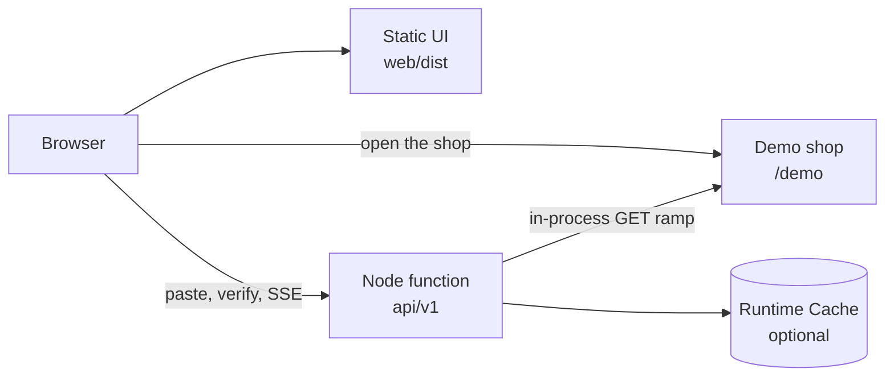
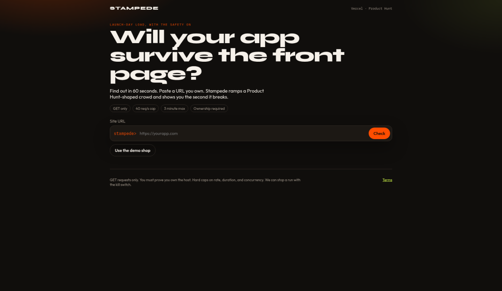
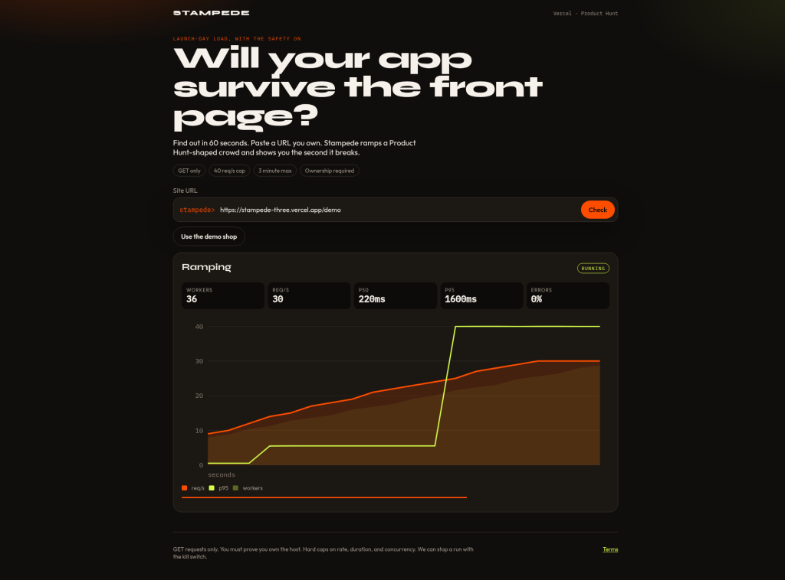
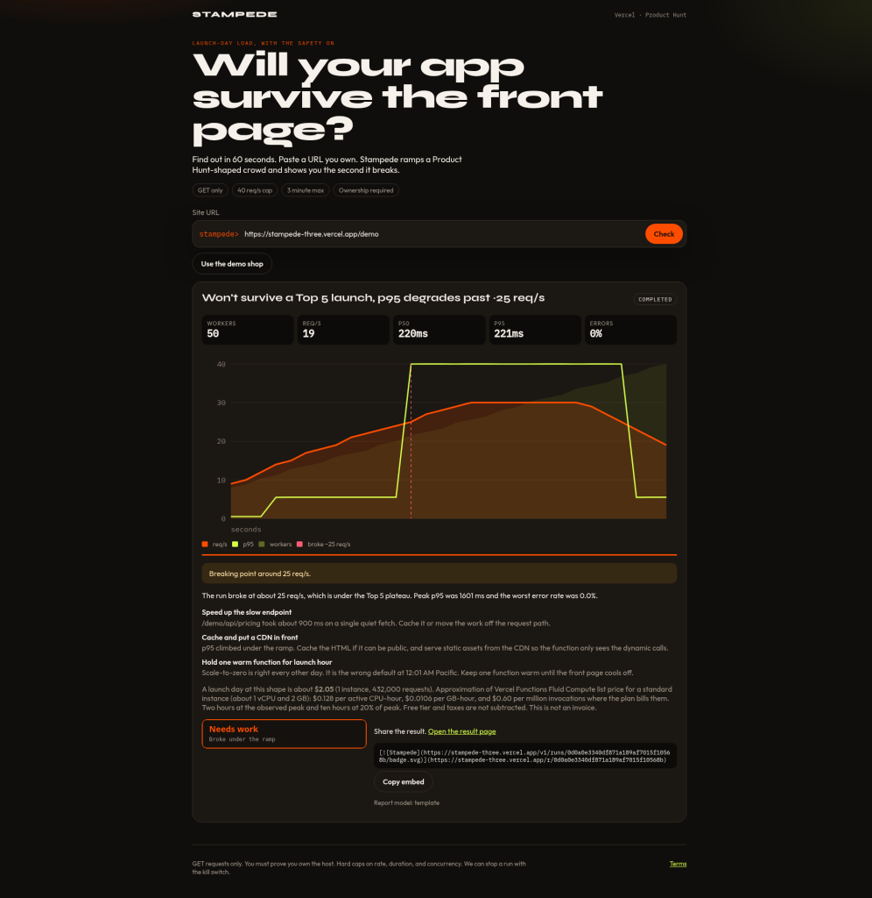

# Stampede

Will your app survive the Product Hunt front page? Find out in about a minute.

Stampede is a launch check for makers. Paste a URL you own, prove it, pick a Product Hunt-shaped traffic curve, and watch requests per second, latency, and errors ramp until the run finds a breaking point. You get a readiness report, a Vercel cost estimate, and a shareable badge.

The public demo runs on **Vercel**. No Google Cloud project is required. The original Cloud Run layout is still in `deploy.sh` if you want to self-host that topology later.

## Deploy on Vercel

The Vercel app is this repository. The project root is the repo root, not `web/`. `vercel.json` builds the Vite UI in `web/` and serves the Node API under `api/`.

Framework preset: **Other**. Do not set the root directory to `web/`.

### Dashboard

1. In the [Vercel dashboard](https://vercel.com/new), import `https://github.com/icohangar-ops/stampede`.
2. Leave the root directory as the repository root. Framework preset: Other. The committed `vercel.json` supplies install, build, and output.
3. No environment variables are required for the demo. The report is the deterministic template.
4. Deploy. Open the production URL, choose **Use the demo shop**, verify, and run **Top 5 of the Day**.

### CLI

From a checkout of this repo, after [installing the Vercel CLI](https://vercel.com/docs/cli) and logging in:

```bash
vercel link
vercel
vercel --prod
```

`vercel` prints a preview URL. `vercel --prod` promotes a production deployment. Do this from the repository root so `vercel.json` is picked up.

The basic demo needs no secrets. Optional variables are listed below.

### What runs in production



| Piece | What it does |
| --- | --- |
| `web/` | The existing React UI. Vite builds it to `web/dist`. |
| `api/v1.js` | Ownership, quotas, the live curve, the report, and the badge. `maxDuration` is 90 seconds. |
| `api/shop.js` | Northwind Kits, the demo shop this deployment owns, at `/demo`. |
| `api/wellknown.js` | `/.well-known/stampede-<token>.txt` for the demo shop, so verification needs no DNS. |
| Runtime Cache | When the function is on Vercel, challenges, quotas, the kill switch, and finished runs are shared across instances in the region. No token to configure. Off Vercel, the same data stays in the instance memory. |

The Go orchestrator and loadgen stay the local and optional self-host path. Production does not call them. The curve runs inside the Node function: GET only, in-process workers, samples streamed back as server-sent events. The embedded shop is not hammered through extra function invocations. A fresh in-process gate still folds the way the Go shop does: above about 24 requests in a second, p95 crosses 1.5s, and above about 34 the homepage returns 503.

The hosted preset is **30 seconds**, not 45. A live Top 5 run on the demo shop can still take about **1–2 minutes** of wall time, because slow responses stretch the ramp even though the curve is labeled 30 seconds. The function limit is 90 seconds. The safety ceiling is still 3 minutes. This deployment refuses a curve longer than 40 seconds (`STAMPEDE_PLATFORM_MAX_SECONDS`) so the function is not killed mid-ramp.

### Hobby and Pro duration

On Fluid Compute, the platform default max duration is **300 seconds on Hobby and on Pro**. Pro and Enterprise can raise one function up to **800 seconds** (1800 seconds in the extended beta). This repo sets the run function to **90 seconds** in `vercel.json` (`api/v1.js`). Hobby also caps a deployment at 12 Serverless Functions, and every file under `api/` counts as one. Shared code lives in `server/lib/`. `npm run build:api` bundles it into three self-contained functions, `api/v1.js`, `api/shop.js`, and `api/wellknown.js`, so the runtime does not load `server/lib` from disk. `/v1/*` is rewritten onto `api/v1.js` (`?path=`). Tests live in `server/lib/`, and the local server is `scripts/dev-api.ts` (`npm run dev:api`).

That 90 second cap is enough for the 30 second public demo. If a project overrides the function limit below 90 seconds, lower `STAMPEDE_DURATION_SECONDS` (default 30) so the curve finishes. To run a longer preset, raise `maxDuration` in `vercel.json` and set `STAMPEDE_PLATFORM_MAX_SECONDS` no higher than 180. Do not go past the 3 minute safety cap.

### Environment variables

None are required for the demo.

| Variable | Required | What it does |
| --- | --- | --- |
| `STAMPEDE_ADMIN_TOKEN` | no | Bearer token for `POST /v1/admin/kill` and `POST /v1/admin/resume`. If unset, those routes refuse every caller. |
| `KILL_SWITCH` | no | Set to `1` to refuse new runs and stop a curve that is already sending. This is the switch that works on every instance. |
| `STAMPEDE_SECRET` | no | HMAC key for challenge ids and demo grants. Defaults to a built-in demo key so the site boots with no secrets. Set a long random value before you care about forged demo grants. External sites are still checked live. The default key does not skip that check. |
| `STAMPEDE_DURATION_SECONDS` | no | Preset length. Default 30. Clamped between 10 and the platform max. |
| `STAMPEDE_PLATFORM_MAX_SECONDS` | no | Longest curve this deployment will start. Default 40. Cannot exceed 180. |
| `STAMPEDE_MAX_RPS` | no | Requests per second cap. Default 40. Cannot be raised above 40. |
| `STAMPEDE_DOMAIN_QUOTA` | no | Runs per target domain per UTC day. Default 3. |
| `DEMO_DOMAIN_QUOTA` | no | Runs per UTC day for this deployment's `/demo`, and for `https://stampede-three.vercel.app/demo`. Default 200, so launch day does not lock the shared shop after 3 visitors. `STAMPEDE_DEMO_DOMAIN_QUOTA` is an alias. Each client IP still uses the quota of 5. Other domains stay on `STAMPEDE_DOMAIN_QUOTA`. |
| `STAMPEDE_ALLOW_HOSTS` | no | Comma-separated hostnames allowed to use a non-public address and a non-80/443 port. Metadata addresses stay blocked. |
| `TRUST_PROXY` | no | Set to `1` to trust `X-Forwarded-For` for quotas. Vercel sets this itself (`VERCEL=1`). |

Nightly retests are not scheduled on Vercel. The checkbox is hidden. The optional Cloud Run self-host path still has the scheduler flag in `deploy.sh`.

## Product loop

1. Paste a URL, or choose **Use the demo shop** (`/demo` on this deployment).
2. Prove ownership with `/.well-known/stampede-<token>.txt` or a DNS TXT record. The demo shop answers the file.
3. Pick **Top 5 of the Day** or **#1 Product of the Day**.
4. Watch the live chart. The preset is labeled 30 seconds. On the demo shop, wall time is often 1–2 minutes.
5. Read the template report, the Vercel cost estimate, and the badge. The result page is `/r/<id>`.

## Traffic assumptions

These curves are planning shapes, not an official Product Hunt traffic feed. The same text is on each preset in the UI.

- A **Top 5 of the Day** launch is planned as roughly **2,000–4,000** launch-day unique visitors. The curve climbs, holds a plateau at **75% of the safety cap**, then eases off.
- A **#1 Product of the Day** launch is planned as roughly **6,000–15,000** launch-day uniques, with about a quarter of them in the first two hours. The curve spikes faster and holds the **full cap**.
- A typical maker page is about **10 HTTP requests per visitor** (the document plus its assets).
- The Vercel demo compresses that morning into **30 seconds**. The local Go runner still defaults to **45 seconds**. Neither path runs longer than **3 minutes**.
- Absolute rates are **scaled to the safety cap** (default 40 requests/second and 50 workers). The shape is the point. The magnitude stays small on purpose.

Workers move from **10 to 50** across the run. On Vercel those are in-process workers inside one function.

## Safety

Stampede is not a load cannon. The Node path enforces the same limits as the Go orchestrator.

- Verified ownership is required before any run. Place `/.well-known/stampede-<token>.txt` or a DNS TXT record. The demo shop answers the file because this deployment owns it. On this host, the only URL Stampede will test is `/demo`.
- GET only. No body, no other method.
- Hard caps: 40 req/s, 50 workers, 3 minutes. This deployment's preset is 30 seconds and it refuses a curve longer than 40 seconds.
- Quotas: 3 runs per external domain per UTC day (`STAMPEDE_DOMAIN_QUOTA`), 5 per client IP. The embedded demo shop uses `DEMO_DOMAIN_QUOTA` (default 200) so visitors are not locked out after a few shared runs. Challenge creation is limited to 30 per IP per hour. On Vercel those counters live in Runtime Cache. Without it, each instance enforces them in memory.
- Private, loopback, link-local, CGNAT, documentation, and reserved ranges are blocked. Cloud metadata (`169.254.169.254` and the metadata hostname) stays blocked even if a host is allowlisted.
- Redirects stay on the same hostname and are rechecked. The dialer pins the resolved address and does not use an HTTP proxy.
- A kill switch stops new runs and in-flight load. Terms are on `/terms`.

External ownership is a live file or TXT check at verify time and again when the run starts. A client-held grant only unlocks the embedded demo shop.

## Run the Vercel path locally

You need Node 22. No Vercel account is required to test.

```bash
npm ci
npm test
npm run build
```

`npm test` covers caps, ownership, quotas, SSRF, the demo fold, and a full demo run. `npm run build` builds the UI.

To click through it, use the Vercel CLI from the repo root:

```bash
npx vercel dev
```

Or run only the API:

```bash
npm run dev:api
```

That listens on `http://127.0.0.1:8787`. The Vite dev server in `web/` still proxies `/v1` to the Go orchestrator on `:8081`, which is the local Go loop below.

## Run the Go stack locally

You need Go 1.22+ and Node 22. No Google Cloud account.

```bash
bash scripts/dev.sh
```

Open http://localhost:8080. Choose **Use the demo shop**, verify with the token file, and run **Top 5 of the Day**. The local ramp is about 45 seconds. The chart, the report, and the badge land on the same page.

| Process | URL |
| --- | --- |
| UI | http://localhost:8080 |
| Orchestrator | http://localhost:8081 |
| Demo shop | http://localhost:8090 |

Docker Compose is the same topology:

```bash
docker compose up --build
```

Local admin token: `local-dev-admin`.

```bash
curl -X POST -H "Authorization: Bearer local-dev-admin" http://localhost:8080/v1/admin/kill
curl -X POST -H "Authorization: Bearer local-dev-admin" http://localhost:8080/v1/admin/resume
```

Go tests:

```bash
go test ./...
```

The Go report still prices a launch day with Cloud Run list rates, because that is the self-host cost model. The Vercel UI and the Node report price Fluid Compute instead.

## Optional: self-host on Cloud Run

`deploy.sh` still deploys the original Go services (web, orchestrator, report, loadgen job) for anyone who wants that topology. The Vercel demo does not use it. Google Cloud credentials are not required for Vercel or for local runs.

```bash
./deploy.sh PROJECT_ID us-central1
```

The script's comments and `cloudbuild.yaml` list the APIs, service accounts, and the spend-cap note. Prefer a budget alert before sharing a Cloud Run URL. Gemini stays optional there: if Vertex is not configured, the report service uses the same deterministic template.

## Screenshots

Live demo: https://stampede-three.vercel.app

A sample Top 5 run on the demo shop came back **Needs work**, breaking at about 25 req/s.







## Open risks

- Runtime Cache is regional and can evict entries. A shared result link is best-effort for about seven days. The browser also keeps the run in `sessionStorage`, and the badge SVG is embedded in the page from that payload.
- Quotas and the admin kill flag are global only when Runtime Cache is available. `KILL_SWITCH=1` is the switch that every instance sees.
- The default `STAMPEDE_SECRET` is in the source. It cannot skip a live ownership check on someone else's host. It can mint a grant for `/demo`, which is the shop this deployment already invites people to test. Set a real secret if that bothers you.
- Preset magnitudes are far below a real #1 launch. That is the safety cap. Do not read the badge as a guarantee about uncapped Product Hunt traffic.
- The Vercel cost line is a planning estimate from a short sample, using published Fluid Compute list prices. It is not an invoice.
- `deploy.sh` has not been executed against a live Google Cloud project. Leave it unused unless you are deliberately self-hosting.
